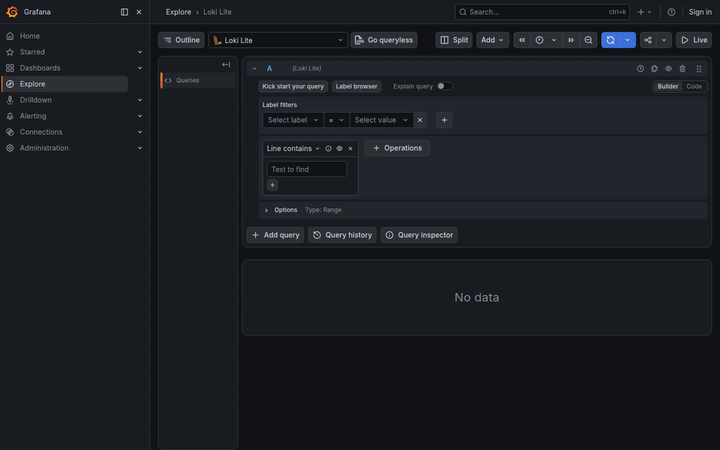

# loki-lite

A Loki-compatible query interface for journald logs. Query-only with no storage of its own — it translates Loki API requests into journald queries.

## Requirements

- **Query only** — no storage, translates Loki API requests into journald queries
- **Pure Go** — installable via `go install github.com/abferm/loki-lite@latest`
- **1-to-1 Loki compatibility** — works with Grafana, logcli, and other Loki clients
- **Embeddable** — other Go apps can import and run the server as an HTTP handler

## Demo

The demo stack (`demo/compose.yaml`) runs loki-lite next to a Grafana instance with the datasource pre-provisioned, ready to explore your host's journald logs:



```bash
docker compose -f demo/compose.yaml up -d --build
```

Then open http://localhost:3000 (Grafana) and query Loki Lite in Explore, or talk to http://localhost:3100 directly with logcli or curl.

## Quick start

```bash
docker compose up -d              # build and start the dev container
docker compose exec dev bash      # open a shell as developer
docker compose down               # stop the container
```

For VS Code: open the repo root and run **Dev Containers: Reopen in Container**.

## Production build

```bash
docker build --target production -t loki-lite .
```

## License

MIT
